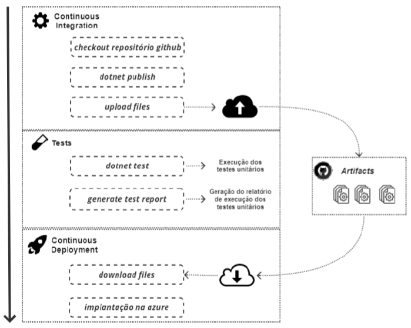

# 5. Implementation Process

The process of continuous integration and deployment of the API that makes up the backend was orchestrated using the GitHub Actions platform. 
In the image below you can see the details of the process.

# Build App
https://docs.expo.dev/build/setup/

- eas build --platform android --profile development
- eas build --platform ios --profile development
- eas build --platform all --profile development